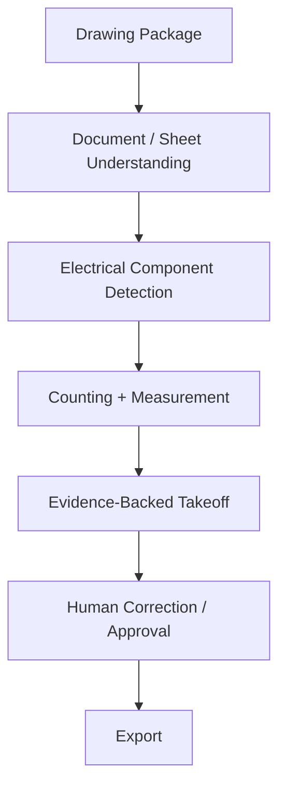

# Vectoris — Product Requirements Document (PRD)

**Status:** LOCKED (MVP scope) · RECOMMENDED (near-term)  
**Owner of:** What the product does, at MVP and near-term  
**Does not own:** Visual design (→ DESIGN.md), DB schema (→ DATA_MODEL.md), model choices (→ AI_SYSTEM.md)

---

## 1. Problem Statement

Electrical/MEP estimators and system integrators spend hours manually counting components on drawings and, downstream, assembling requirement-driven solutions into priced proposals. Category-level pain is corroborated by secondary research (6–12h manual estimates, ~38% material-pricing error rate in industry benchmarks); severity for Vectoris's specific target segment is **not yet validated** — see legacy `THESIS.md` Gates for the validation framework this PRD assumes is still in force.

## 2. MVP — Locked

The MVP is **drawing-first**. This does not mean Vectoris only ever accepts drawings — the architecture is prepared for multiple input types (requirements, existing BOQs, specifications) per `VISION.md` — but only the drawing-based takeoff workflow is fully implemented at MVP. See `MVP_BOUNDARY.md` for the explicit in/out list.

### 2.1 MVP Functional Requirements

| ID | Requirement | Priority |
|---|---|---|
| FR-1 | Ingest PDF drawing packages (clean and scanned) | P0 |
| FR-2 | Split and classify sheets | P0 |
| FR-3 | Detect electrical components with source-region evidence | P0 |
| FR-4 | Support discrete counting (fixtures, receptacles, panels) | P0 |
| FR-5 | Support geometry/length measurement (cable tray, conduit) | P0 |
| FR-6 | Present side-by-side drawing + takeoff review UI | P0 |
| FR-7 | Allow accept/reject/edit/add/delete on any detection | P0 |
| FR-8 | Capture every correction as a structured, attributed event | P0 |
| FR-9 | Export takeoff to XLSX/CSV/JSON/PDF on demand | P0 |
| FR-10 | Support organizations, roles, and multi-user projects | P0 |
| FR-11 | Support project chat sessions (multiple threads per project) | P0 |
| FR-12 | AI agent can inspect files, run detection/measurement tools, and answer questions with traceable evidence | P0 |

### 2.2 MVP Input Formats

PDF (native + scanned), DWG, DXF, images, Excel, and other project file formats must be **architecturally supported** (ingestion abstraction), even though the technical spike and initial detection quality bar target PDF first. Real-world messiness (rotation, low resolution, mixed file types, annotations, incomplete packages, duplicates, conflicting documents) is a first-class design input, not an edge case — see `03_ARCHITECTURE/ARCHITECTURE.md` §Ingestion.

### 2.3 Explicitly Out of MVP

CPQ, pricing, labor estimation, procurement, full ERP/CRM, project management, proposal generation, autonomous pricing decisions. Full list and rationale: `MVP_BOUNDARY.md`.

## 3. Near-Term Expansion (Not MVP, Not Yet Authorized)

- Requirement-based entry point (H2 pathway): requirement → application/where-used mapping → product selection → BOQ
- Multi-file, cross-document agent reasoning
- Session-level sharing/permissions
- Company memory (preferred manufacturers, naming conventions, recurring assemblies)

Authorization to build any of the above requires passing the relevant Gate in the legacy `THESIS.md` Gates framework — this PRD does not grant that authorization on its own.

## 4. Long-Term Vision

See `VISION.md` §3 and `../LONG_TERM_VISION.md`.

## 5. Non-Functional Requirements

| ID | Requirement |
|---|---|
| NFR-1 | Local-first: project files primarily remain on the user's device (see `STORAGE.md`) |
| NFR-2 | No customer drawing leaves the device to a cloud model without explicit, auditable authorization (see `SECURITY.md`) |
| NFR-3 | Every AI detection is traceable to source document + coordinates + model version |
| NFR-4 | Every human correction is captured as a structured, attributed, timestamped event |
| NFR-5 | Large drawing packages (100+ sheets) must remain usable — exact performance targets TBD, require technical spike |
| NFR-6 | System must degrade gracefully on malformed/corrupted/incomplete input, never silently fail |

## 6. Success Criteria (MVP)

Mirrors legacy `README.md` Success Definition Levels 1–2 and `SCOPE.md` §25:

- **Level 1 (Prototype):** AI-assisted takeoff is measurably faster than manual on the same real project.
- **Level 2 (Product):** A user voluntarily returns to use Vectoris on a second project without prompting.

Numeric thresholds (e.g., ">30% time reduction") are carried forward as **hypotheses to validate**, not committed product guarantees — see legacy `THESIS.md` Gate 4.

## 7. Cross-References

- Scope boundary detail: `PRODUCT_SCOPE.md`, `../MVP_BOUNDARY.md`
- Workflows: `../01_PRODUCT/CORE_WORKFLOWS.md`
- Data model: `../03_ARCHITECTURE/DATA_MODEL.md`
- AI behavior: `../04_AI/AI_SYSTEM.md`
