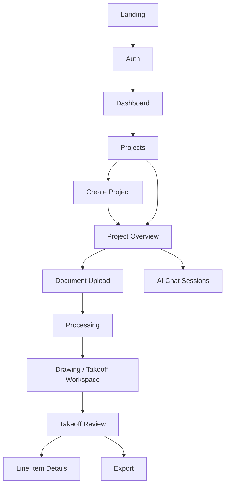

# Vectoris — App Flow

**Status:** LOCKED (navigation graph for MVP pages)  
**Owner of:** Navigation graph between pages/states  
**Does not own:** Individual page behavior (→ 06_PAGES), workflow business logic (→ CORE_WORKFLOWS.md)

---

## 1. Top-Level Navigation Graph

## 2. Contextual Surfaces (Not Standalone Pages)

Per founder decision, the following are modal/drawer/popover/command-surface UI, not dedicated pages: organization settings, member management, billing, project settings, session sharing permissions. They can be invoked from Dashboard, Project Overview, or a global command surface, but do not have their own top-level route in this app-flow graph.

## 3. Entry/Exit Conditions Summary

| Page | Typical Entry | Typical Exit |
|---|---|---|
| Landing | Unauthenticated user | → Auth |
| Auth | From Landing or session expiry | → Dashboard on success |
| Dashboard | Post-auth | → Projects, → Create Project |
| Projects | From Dashboard | → Create Project, → Project Overview |
| Create Project | From Projects/Dashboard | → Project Overview on success |
| Project Overview | From Projects, or post-creation | → Document Upload, → Sessions (open existing or start new), → Takeoff Review (if takeoff exists) |
| Document Upload | From Project Overview | → Processing |
| Processing | Post-upload | → Drawing Viewer (auto or on completion) |
| Drawing / Takeoff Workspace | Post-processing, or returning to existing project | → Takeoff Review |
| Takeoff Review | From workspace | → Line Item Details, → Export |
| Line Item Details | From Takeoff Review | → back to Takeoff Review |
| Export | From Takeoff Review | Download; stays on Takeoff Review |

Full per-page entry/exit detail: individual files in `../06_PAGES/`.

## 4. Cross-References

- Business logic behind each transition: `CORE_WORKFLOWS.md`
- Page specs: `../06_PAGES/*`
