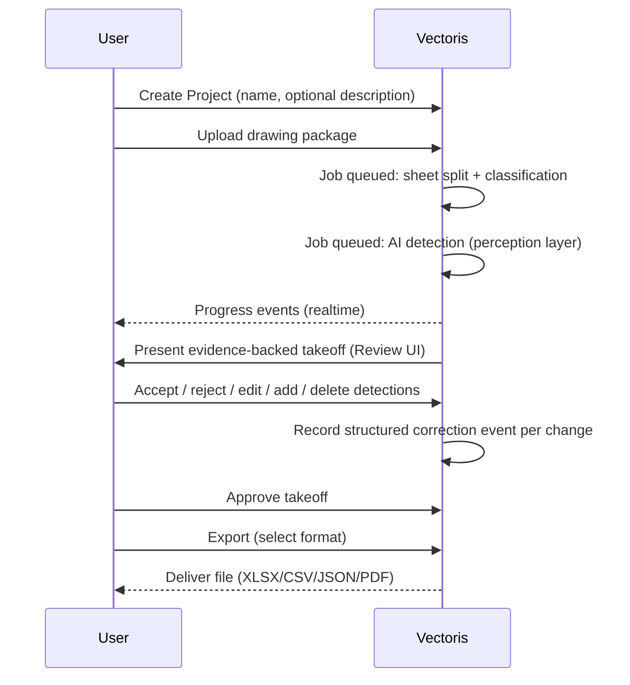
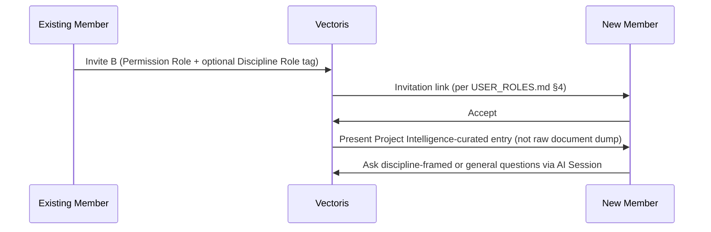

# Vectoris — Core Workflows

**Status:** LOCKED (MVP workflows)  
**Owner of:** End-to-end workflows spanning multiple pages/states  
**Does not own:** Screen-by-screen layout (→ 06_PAGES), navigation graph (→ APP_FLOW.md)

---

## 1. Workflow: Project Creation → Upload → Takeoff → Export



## 2. Workflow: AI Correction Capture

Every correction is captured with: AI result, human final value, delta, user, timestamp, source, model version (see `../03_ARCHITECTURE/DATA_MODEL.md` for exact schema). This is **not** optional telemetry — it is the structural foundation for `../04_AI/TRAINING.md`.

```text
AI proposes (e.g., 43 fixtures)
   -> Human reviews
   -> Human accepts, edits, or deletes
   -> Correction event recorded (type + reason + evidence link)
   -> Event is NOT automatically training data (see TRAINING.md classification step)
```

## 3. Workflow: Manual Line Item Creation

A user can create a line item Vectoris did not detect: draw a bounding box → classify it → it enters the same structured line-item model as an AI detection, flagged `source: human_created` (see `DATA_MODEL.md`). This keeps the takeoff table's data model uniform regardless of origin.

## 4. Workflow: AI Chat Session (Agentic)

```mermaid
flowchart TD
    A[User asks a question in a project session] --> B[Brain interprets intent]
    B --> C[Brain identifies relevant files/context]
    C --> D[Brain selects tool(s)]
    D --> E[Tool executes: e.g., inspect drawing, measure geometry]
    E --> F[Control/Verification checks evidence + permissions]
    F --> G[Result returned with source evidence links]
    G --> H{Ambiguous or insufficient info?}
    H -->|Yes| I[Ask clarifying question]
    H -->|No| J[Present structured result to user]
```

See `../04_AI/AI_SYSTEM.md` for the full agent architecture this workflow depends on.

## 5. Workflow: Organization & Collaboration

Org creation → Owner invites members via link → role assignment → multiple users work concurrently on the same project (see `USER_ROLES.md`). Concurrent-edit conflict handling: TBD, requires architecture decision in `../03_ARCHITECTURE/EVENT_SYSTEM.md`.

## 6. Workflow: Export

Structured takeoff data (source of truth) → user selects format from a Download/overflow menu → Vectoris transforms internal data → delivers file. Exported files are **never** the canonical source of truth (see `PRD.md` NFR and `../06_PAGES/EXPORT.md`).

## 6a. Workflow: Refer Team Member Into an Existing Project (NEAR-TERM — see `../DOMAIN/COLLABORATION.md`)



This workflow does not change the invitation mechanism already specified in `USER_ROLES.md` §4. It adds an optional Discipline Role tag and a Project Intelligence-driven landing experience — see `../DOMAIN/COLLABORATION.md` and `../DOMAIN/PROJECT_INTELLIGENCE.md`. Status: NEAR-TERM, OPEN DECISION (OD-25) — not yet authorized for build.

## 6b. Workflow: Project Understanding Synthesis (NEAR-TERM — see `../DOMAIN/PROJECT_INTELLIGENCE.md`)

```text
User asks (in an AI Session, project-scoped): "Explain this project to me" / "What's unresolved?"
   -> Agent reads across: documents, takeoff state, prior sessions, decisions, activity
   -> Agent classifies each claim: known-from-evidence / inferred / human-decided / unresolved
   -> Agent responds, evidence-linked, explicitly marking gaps as gaps (not silently omitted)
```

This is the same evidence-linking discipline `AI_SESSION.md` §AI Behavior already requires for single-document questions, applied at project scope. Status: NEAR-TERM, OPEN DECISION (OD-24) — requires a defined grounding procedure before build; see `../DOMAIN/PROJECT_INTELLIGENCE.md` §4.

## 7. Cross-References

- Page-level detail for each step: `../06_PAGES/*`
- Navigation between states: `APP_FLOW.md`
- Data captured at each step: `../03_ARCHITECTURE/DATA_MODEL.md`
