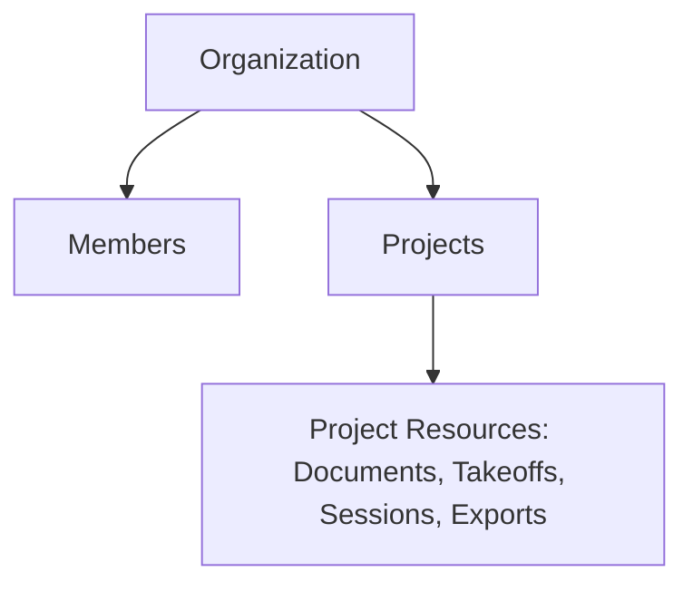

# Vectoris — User Roles

**Status:** LOCKED (role list and permission matrix)  
**Owner of:** Organization roles and permission scopes  
**Does not own:** UI surfaces for role management (→ page docs), auth mechanics (→ SECURITY.md)

---

## 1. Hierarchy

## 2. Roles (Organization Scope)

| Role | Description | Assigned By |
|---|---|---|
| **Owner** | Full control; organization creator by default; billing/deletion authority | System (on creation), transferable |
| **Admin** | Full member/project management, no billing/deletion | Owner |
| **Manager** | Manages projects and members within assigned scope; cannot manage org-level settings | Owner/Admin |
| **Editor** | Full read/write on assigned projects: upload, correct, export | Owner/Admin/Manager |
| **Viewer** | Read-only on assigned projects | Owner/Admin/Manager |

## 3. Permission Scopes

Permissions are evaluated at three levels: **Organization**, **Project**, **Session**. A user's effective permission on a resource is the most specific applicable grant.

| Action | Owner | Admin | Manager | Editor | Viewer |
|---|---|---|---|---|---|
| Manage org settings/billing | Yes | No | No | No | No |
| Invite/remove members | Yes | Yes | Scoped | No | No |
| Create project | Yes | Yes | Yes | Yes | No |
| Upload documents | Yes | Yes | Yes | Yes | No |
| Correct/approve takeoff | Yes | Yes | Yes | Yes | No |
| Export | Yes | Yes | Yes | Yes | No |
| Share session | Yes | Yes | Yes | Owner of session | No |
| Delete project | Yes | Yes | No | No | No |

## 4. Invitations

Users are invited via invitation links (per founder decision, §8 of brief). Link-based invites carry: organization ID, assigned role, expiry (14 days), and are single-use.

## 5. Session-Level Permissions

Independent of project role, a session can be shared with specific users at **Viewer** or **Editor** granularity (see `CORE_WORKFLOWS.md` §Sessions and `../06_PAGES` for session UI). Session sharing must not implicitly grant broader project access — a session Viewer does not thereby gain project Viewer rights unless also granted at the project level. This is a deliberate isolation boundary; see `../03_ARCHITECTURE/SECURITY.md`.

## 6. Cross-References

- Data model for roles/membership: `../03_ARCHITECTURE/DATA_MODEL.md`
- Enforcement architecture: `../03_ARCHITECTURE/SECURITY.md`
