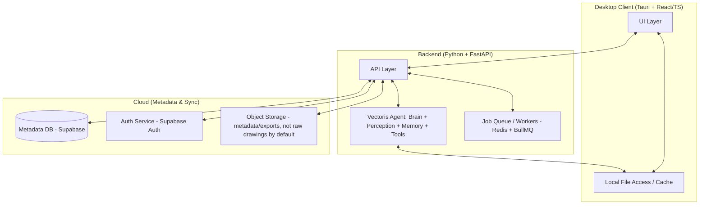
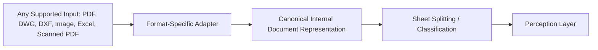

# Vectoris — Architecture

**Status:** RECOMMENDED (system shape) · see `TECH_STACK.md` for locked technology choices  
**Owner of:** System-level architecture and boundaries  
**Does not own:** Concrete technology choices (→ TECH_STACK.md), entity schema (→ DATA_MODEL.md)

---

## 1. System Overview

## 2. Architectural Principles

1. **Local-first.** Raw project files primarily live on the user's device. Cloud handles organization metadata, users, roles, permissions, sync state, project metadata, sessions, audit metadata, model metadata, settings. See `STORAGE.md`.
2. **Agentic AI, not monolithic model.** The AI system is decomposed into Perception, Brain, Memory, Tools, and Control/Verification. See `../04_AI/AI_SYSTEM.md`.
3. **Language boundary by responsibility, not by layer.** Rust/Tauri owns native/filesystem/OS integration; Python owns AI/ML/document processing; TypeScript/React owns UI. See `TECH_STACK.md`.
4. **Volatile data never enters model weights.** Pricing, catalogs, and other frequently-changing facts live in retrieval/database layers, never baked into a fine-tuned model — preserved from the legacy README's "Four Memory Layers" hard rule.
5. **Every AI action is auditable.** See `../04_AI/MODEL_GOVERNANCE.md` and `EVENT_SYSTEM.md`.
6. **Long-running work never blocks the UI.** All heavy processing (ingestion, detection, measurement) runs through the job/worker system. See `EVENT_SYSTEM.md`.

## 3. Ingestion Architecture (Input Abstraction)

Each input format has a dedicated adapter producing a canonical internal representation, so downstream perception/detection logic is format-agnostic. Only the PDF/scanned-PDF adapter is fully implemented at MVP (per `../00_PROJECT/PRODUCT_SCOPE.md`); other adapters are architected but may be stubbed or partial. Exact adapter implementation for DWG/DXF: **TBD, requires technical spike.**

Real-world messiness handling (rotation, low resolution, mixed file types, annotations, malformed/corrupted files, duplicates, incomplete packages, conflicting documents) is a required property of every adapter, not a v2 concern — each adapter must define explicit failure/degradation behavior (see `PRD.md` NFR-6).

## 4. Multi-Tenancy

Organization → Members → Projects → Project Resources (see `../01_PRODUCT/USER_ROLES.md`). Tenant isolation is enforced at the API layer and at the storage layer; exact mechanism (row-level security vs. application-level filtering) is a `DATA_MODEL.md` / `SECURITY.md` decision.

## 5. Cross-References

- `TECH_STACK.md`, `SYSTEM_COMPONENTS.md`, `DATA_MODEL.md`, `EVENT_SYSTEM.md`, `STORAGE.md`, `SECURITY.md`
- `../04_AI/AI_SYSTEM.md`
