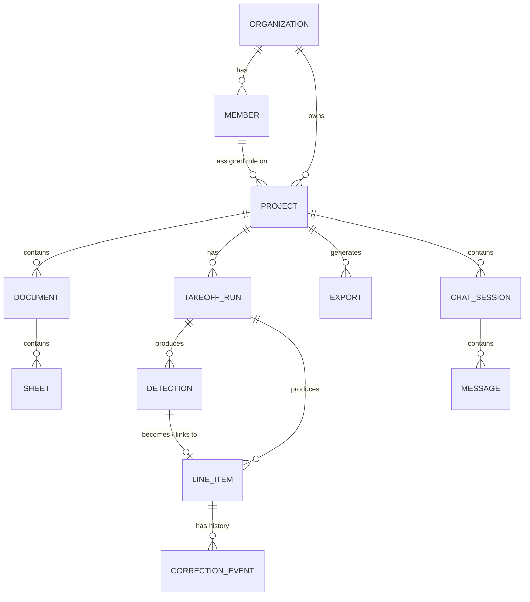

# Vectoris — Data Model

**Status:** RECOMMENDED (conceptual model) · LOCKED (database engine)  
**Owner of:** Entity model and relationships  
**Does not own:** API routes (→ API_ARCHITECTURE.md), storage/sync mechanics (→ STORAGE.md)

---

## 1. Conceptual Entity Model

This is a **conceptual** model per the founder brief §28 — not a final schema. Refinement into concrete tables/collections happens during implementation, informed by the DB ADR below.

## 2. Core Entities (Conceptual Fields)

### Organization
`id, name, owner_id, created_at, settings`

### Member
`id, organization_id, user_id, role, invited_by, joined_at`

### Project
`id, organization_id, name, description (optional), inferred_type, user_provided_type, verified_type, created_by, created_at, updated_at`

Project type distinguishes **AI-inferred context**, **user-provided context**, and **verified/final context** as three separate fields — per founder decision §4, these must never be conflated into a single "type" value.

### Document
`id, project_id, filename, format, upload_status, storage_reference (local path / object ref), uploaded_by, uploaded_at`

### Sheet
`id, document_id, sheet_index, classification, page_dimensions`

### Takeoff Run
`id, project_id, triggered_by, model_version, started_at, completed_at, status`

> **Open schema question:** which Documents/Sheets are included in a given Takeoff Run is not yet an explicit field on this entity. For single-document projects this is implied; for multi-document projects, a `documents_in_scope[]` or `sheets_in_scope[]` field is likely needed. **TBD at implementation phase** — flagged to `../OPEN_DECISIONS.md`.

### Detection
`id, takeoff_run_id, sheet_id, component_type, quantity_or_geometry, source_coordinates, confidence (internal only), model_version, created_at`

### Line Item
`id, project_id, source (ai_detection | human_created), current_value, unit_of_measure, status (proposed | approved), linked_detection_id (nullable)`

### Correction Event
`id, line_item_id, ai_value, human_value, delta, correction_type, correction_reason, user_id, timestamp, source, model_version`

Mirrors the legacy README MVP Data Model record structure and correction taxonomy (`missed`, `false_positive`, `wrong_symbol`, `wrong_classification`, `duplicate`, `scope_excluded`, `sheet_conflict`, `manual_override`, `other`), preserved unchanged as the canonical taxonomy.

### Export
`id, project_id, format, generated_by, generated_at, storage_reference`

### Chat Session
`id, project_id, title, created_by, created_at, sharing_permissions[]`

### Message
`id, session_id, role (user | agent), content, tool_calls[], evidence_links[], timestamp`

## 3. Critical Principle — Correction ≠ Training Data

A correction event is a record of what happened. It does **not** automatically become AI training data. Classification and validation (see `../04_AI/TRAINING.md`) is a separate downstream pipeline step. This mirrors the legacy README's explicit warning against "human correction → automatic retraining."

## 4. ADR — Status: LOCKED (Supabase/PostgreSQL)
- **Context:** Vectoris needs multi-tenant metadata storage with permissions, collaboration, and future project-management-scale relational needs, while remaining consistent with a local-first architecture where raw project data is not centrally stored by default.

| Dimension | Firestore | Supabase / PostgreSQL |
|---|---|---|
| Offline-first capability | Strong native offline support (mobile/web SDKs) | Weaker native offline story; would need custom sync layer |
| Sync | Built-in realtime sync | Requires realtime add-on (Supabase Realtime) or custom |
| Relational data | Document/NoSQL — relational queries (joins) are awkward | Native relational (Postgres) — strong fit for org/project/role graphs |
| Permissions | Security Rules (declarative, per-document) | Row-Level Security (SQL-native, mature tooling) |
| Collaboration | Realtime listeners well-suited to concurrent editing | Requires more custom realtime wiring |
| Auditability | Possible but requires custom event modeling | Strong (SQL triggers, structured audit tables) |
| Querying | Limited compound queries, no joins | Full SQL — strong for reporting/analytics as PM features grow |
| Scaling | Google-managed, scales well for read-heavy document access | Postgres scaling is well-understood but needs more ops ownership (or managed Supabase) |
| Developer ergonomics | Fast to prototype, less schema discipline | Stronger typing/schema discipline, better fit for a growing relational domain (orgs, roles, projects, line items) |
| Security | Mature, Google-managed | Mature, Postgres RLS well understood |
| Cost | Pay-per-read/write, can surprise at scale | More predictable at scale, self-hostable |
| Local caching | Native offline cache built in | Requires custom local cache layer, consistent with Vectoris's local-first file architecture anyway |
| Future PM requirements | Weaker fit for deeply relational project-management data (dependencies, timelines) | Strong fit — this is exactly what relational databases are for |

- **Recommendation:** Supabase/PostgreSQL is the architecturally stronger long-term fit given Vectoris's relational domain (orgs → roles → projects → line items → corrections) and the long-term project-management vision, which will need real relational querying. Firestore's realtime/offline strengths are attractive but less decisive given Vectoris is already local-first at the file layer (raw drawings), so the cloud DB's job is metadata/collaboration, not offline file sync.
- **Final status:** **LOCKED: Supabase/PostgreSQL**. This reverses the founder's initial default candidate based on the stated evaluation criteria and was confirmed by the founder. Firestore is REJECTED.

## 5. Cross-References

- `STORAGE.md` for local-vs-cloud data placement
- `../04_AI/TRAINING.md` for the correction → training pipeline
- `../01_PRODUCT/USER_ROLES.md` for the role values referenced in Member
