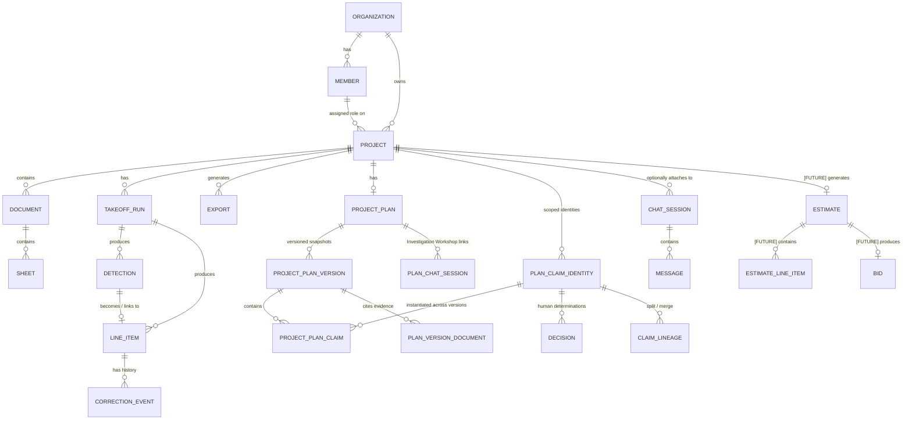

# Vectoris — Data Model

**Status:** RECOMMENDED (conceptual model) · LOCKED (database engine)  
**Owner of:** Entity model and relationships  
**Does not own:** API routes (→ API_ARCHITECTURE.md), storage/sync mechanics (→ STORAGE.md)

---

## 1. Conceptual Entity Model

This is a **conceptual** model per the founder brief §28 — not a final schema. Refinement into concrete tables/collections happens during implementation, informed by the DB ADR below.

## 2. Core Entities (Conceptual Fields)

### Organization
`id, name, owner_id, created_at, settings`

### Member
`id, organization_id, user_id, role, invited_by, joined_at`

### Project
`id, organization_id, name, description (optional), inferred_type, user_provided_type, verified_type, created_by, created_at, updated_at`

Project type distinguishes **AI-inferred context**, **user-provided context**, and **verified/final context** as three separate fields — per founder decision §4, these must never be conflated into a single "type" value.

### Project Plan
`id, project_id (unique — one logical plan per project), created_at, updated_at`

### Project Plan Version
`id, plan_id, version_number, status (draft | active | superseded), created_by, created_at, activated_at, superseded_at`

- Content (claims, grounding, evidence links) is strictly immutable post-creation.
- Exactly one open draft per plan (`status = 'draft'`) enforced at the database level.
- Exactly one active version per plan (`status = 'active'`).

### Plan Claim Identity
`claim_id (UUID primary key, created once, never reused, project-scoped), project_id, created_at`

The claim identity is the stable identity across plan versions. A claim appearing in v1, v2, and v3 shares the same `claim_id`.

### Project Plan Claim
`id, claim_id (references plan_claim_identities), plan_version_id (references project_plan_versions), section ('scope_outcomes' | 'milestones' | 'risks' | 'dependencies'), content, grounding ('known_from_evidence' | 'inferred' | 'human_decided' | 'unresolved'), evidence_links (JSONB), inference_rationale, unresolved_reason, conflict_with_decision_id (nullable), conflict_details`

### Claim Lineage
`id, parent_claim_id, child_claim_id, relationship ('split' | 'merge'), occurred_at, triggering_plan_version_id`

Database triggers enforce that parent claim, child claim, and triggering plan version belong to the same project. Decisions are never automatically transferred across lineage.

### Decision
`id, claim_id (references plan_claim_identities), project_id, decision_text, rationale, decided_by, decided_at, superseded_by, superseded_at, is_active`

First-class append-only entity attached to the stable `claim_id` identity, persisting across plan versions.

### Plan Version Document
`plan_version_id, document_id` (normalized association with project consistency trigger)

### Plan Chat Session
`plan_id, chat_session_id, created_at` (permanent normalized link to an ordinary project-scoped Investigation Workshop session)

### Document
`id, project_id, filename, format, upload_status, storage_reference (local path / object ref), uploaded_by, uploaded_at`

### Sheet
`id, document_id, sheet_index, classification, page_dimensions`

### Takeoff Run
`id, project_id, triggered_by, model_version, started_at, completed_at, status`

> **Open schema question:** which Documents/Sheets are included in a given Takeoff Run is not yet an explicit field on this entity. For single-document projects this is implied; for multi-document projects, a `documents_in_scope[]` or `sheets_in_scope[]` field is likely needed. **TBD at implementation phase** — flagged to `../OPEN_DECISIONS.md`.

### Detection
`id, takeoff_run_id, sheet_id, component_type, quantity_or_geometry, source_coordinates, confidence (internal only), model_version, created_at`

### Line Item
`id, project_id, source (ai_detection | human_created), current_value, unit_of_measure, status (proposed | approved | rejected), linked_detection_id (nullable)`

Status values:
- `proposed` — AI-produced candidate; not yet human-reviewed
- `approved` — explicitly accepted by a human; forms the verified takeoff
- `rejected` — explicitly rejected by a human; retained for audit, never silently deleted

Only `approved` items are used as the basis for export or [FUTURE] estimation.

### Correction Event
`id, line_item_id, ai_value, human_value, delta, correction_type, correction_reason, user_id, timestamp, source, model_version`

Mirrors the legacy README MVP Data Model record structure and correction taxonomy (`missed`, `false_positive`, `wrong_symbol`, `wrong_classification`, `duplicate`, `scope_excluded`, `sheet_conflict`, `manual_override`, `other`), preserved unchanged as the canonical taxonomy.

### Export
`id, project_id, format, generated_by, generated_at, storage_reference`

### Chat Session
`id, project_id (nullable — NULL = general conversation), title, created_by, created_at, updated_at, sharing_permissions[]`

`project_id` is explicitly nullable:
- `project_id = NULL` → general conversation (no project context)
- `project_id = <uuid>` → attached to that project; AI context is scoped to project data

Both types are the same entity. There is no separate "general session" model.

### Message
`id, session_id, role (user | agent), content, tool_calls[], evidence_links[], timestamp`

## 3. Future Entity Stubs (NOT MVP — do not implement)

The following entities are architecturally planned as downstream stages in the project pipeline. They are documented here to provide the skeleton before the features are built. They must NOT be implemented until the relevant Open Decision is resolved and this section is updated to RECOMMENDED.

### Estimate [FUTURE — not MVP]
`id, project_id, takeoff_run_id, created_by, created_at, status`

Consumes approved Line Items from a Takeoff Run. Source of truth for all cost calculation. See OD-22 for entity model decision.

### Estimate Line Item [FUTURE — not MVP]
`id, estimate_id, line_item_id, unit_rate, quantity, subtotal, ...`

Exact fields TBD pending OD-22 resolution. Do not invent pricing logic.

### Bid [FUTURE — not MVP]
`id, project_id, estimate_id, created_by, created_at, status`

Consumes an Estimate. Entirely unspecified — see OD-23. Do not design or build until OD-23 is resolved with a full product specification.

---

## 4. Critical Principle — Correction ≠ Training Data

A correction event is a record of what happened. It does **not** automatically become AI training data. Classification and validation (see `../04_AI/TRAINING.md`) is a separate downstream pipeline step. This mirrors the legacy README's explicit warning against "human correction → automatic retraining."

## 4. ADR — Status: LOCKED (Supabase/PostgreSQL)
- **Context:** Vectoris needs multi-tenant metadata storage with permissions, collaboration, and future project-management-scale relational needs, while remaining consistent with a local-first architecture where raw project data is not centrally stored by default.

| Dimension | Firestore | Supabase / PostgreSQL |
|---|---|---|
| Offline-first capability | Strong native offline support (mobile/web SDKs) | Weaker native offline story; would need custom sync layer |
| Sync | Built-in realtime sync | Requires realtime add-on (Supabase Realtime) or custom |
| Relational data | Document/NoSQL — relational queries (joins) are awkward | Native relational (Postgres) — strong fit for org/project/role graphs |
| Permissions | Security Rules (declarative, per-document) | Row-Level Security (SQL-native, mature tooling) |
| Collaboration | Realtime listeners well-suited to concurrent editing | Requires more custom realtime wiring |
| Auditability | Possible but requires custom event modeling | Strong (SQL triggers, structured audit tables) |
| Querying | Limited compound queries, no joins | Full SQL — strong for reporting/analytics as PM features grow |
| Scaling | Google-managed, scales well for read-heavy document access | Postgres scaling is well-understood but needs more ops ownership (or managed Supabase) |
| Developer ergonomics | Fast to prototype, less schema discipline | Stronger typing/schema discipline, better fit for a growing relational domain (orgs, roles, projects, line items) |
| Security | Mature, Google-managed | Mature, Postgres RLS well understood |
| Cost | Pay-per-read/write, can surprise at scale | More predictable at scale, self-hostable |
| Local caching | Native offline cache built in | Requires custom local cache layer, consistent with Vectoris's local-first file architecture anyway |
| Future PM requirements | Weaker fit for deeply relational project-management data (dependencies, timelines) | Strong fit — this is exactly what relational databases are for |

- **Recommendation:** Supabase/PostgreSQL is the architecturally stronger long-term fit given Vectoris's relational domain (orgs → roles → projects → line items → corrections) and the long-term project-management vision, which will need real relational querying. Firestore's realtime/offline strengths are attractive but less decisive given Vectoris is already local-first at the file layer (raw drawings), so the cloud DB's job is metadata/collaboration, not offline file sync.
- **Final status:** **LOCKED: Supabase/PostgreSQL**. This reverses the founder's initial default candidate based on the stated evaluation criteria and was confirmed by the founder. Firestore is REJECTED.

## 5. Cross-References

- `STORAGE.md` for local-vs-cloud data placement
- `../04_AI/TRAINING.md` for the correction → training pipeline
- `../01_PRODUCT/USER_ROLES.md` for the role values referenced in Member
