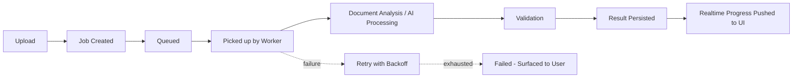

# Vectoris — Event & Background Processing System

**Status:** LOCKED (principles and queue technology)  
**Owner of:** Async/event/job architecture  
**Does not own:** API contract shape (→ API_ARCHITECTURE.md)

---

## 1. Why This Exists

Long-running operations (document ingestion, AI detection, measurement, large exports) must never block the API or UI. Per founder instruction §21, the system must support: job queues, workers, progress events, retries, cancellation where feasible, failure recovery, and idempotency.

## 2. Job Lifecycle

## 3. Required Properties

| Property | Requirement |
|---|---|
| Progress visibility | UI receives incremental progress, not just terminal success/fail |
| Retries | Transient failures retry automatically with backoff; permanent failures surface clearly |
| Cancellation | User can cancel a queued/in-progress job where the underlying operation supports safe interruption |
| Idempotency | Re-submitting the same job (e.g., due to a client retry) must not duplicate results |
| Failure recovery | A crashed worker must not silently lose a job; jobs must be resumable or clearly marked failed |

## 4. Realtime Delivery to UI

Mechanism (WebSocket vs. Server-Sent Events vs. polling): **TBD.** Recommend starting with a simple polling or SSE approach for MVP given the desktop client's local-first nature, upgrading to WebSocket only if UX requirements demand sub-second updates — this avoids premature infrastructure complexity.

## 5. Queue Technology (Locked)

The queue architecture is **LOCKED** to **Redis + Celery**.

**Architecture:**
- FastAPI (Job Gateway)
- Redis (Message broker)
- Celery Workers (Python-native, processing jobs)

**Why Redis + Celery:**
- Keeps the entire backend and worker stack strictly Python-native.
- Native support for retries, rate limiting, and parent/child job dependencies (chains, groups, chords), which are required for the document-to-sheet ingestion pipeline.
- Workers can import and call Perception/Brain/Tool Executor code directly with no cross-process boundary.

## 6. Concurrent Editing / Conflict Handling

Multiple users editing the same project concurrently (per `../01_PRODUCT/USER_ROLES.md` §5, `CORE_WORKFLOWS.md` §5) requires a conflict resolution strategy. **TBD** — options include last-write-wins per field, optimistic locking, or operational-transform/CRDT-style merging for the takeoff table specifically. This is a meaningful open decision, not a detail; flagged in `../OPEN_DECISIONS.md`.

## 7. Cross-References

- `API_ARCHITECTURE.md`, `ARCHITECTURE.md`
- `../05_IMPLEMENTATION/BACKEND.md` for eventual technology lock-in
