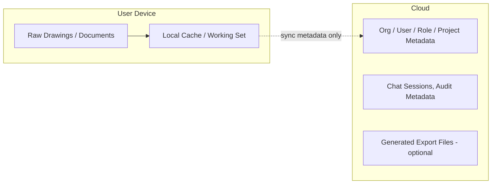

# Vectoris — Storage Architecture

**Status:** LOCKED (local-first principle & cloud items)  
**Owner of:** Local-first storage & sync architecture  
**Does not own:** Database engine choice detail (→ DATA_MODEL.md ADR), security controls (→ SECURITY.md)

---

## 1. Core Principle

**Local-first.** Project files (drawings, documents) primarily live on the user's device. Cloud handles organization metadata, users, roles, permissions, synchronization state, project metadata, sessions, audit metadata, model metadata, and settings — not raw drawings by default.

## 2. Data Placement

| Data type | Location | Notes |
|---|---|---|
| Raw drawings/documents | Device (local) | Never uploaded by default |
| Takeoff structures / Line items | Cloud | Synced for cross-device/collaboration and reporting |
| Organization/user/role metadata | Cloud | Required for multi-tenant collaboration |
| Sessions, messages, and AI outputs | Cloud | Content may reference local evidence via pointers, not raw file copies |
| Audit/correction events | Cloud | Required for cross-device auditability and future training pipeline |
| Sync state | Cloud | Manages sync between local device files and cloud metadata |
| Export artifacts | Local or Cloud | Local generation by default; cloud storage if explicitly shared |

## 3. Cloud Provider (Locked)

Supabase PostgreSQL is the locked provider for all cloud-based relational metadata and state. Object storage for shared artifacts is also managed via Supabase.

## 4. Cloud Processing Consent

If cloud perception models are ever used (see `../04_AI/PERCEPTION.md`), any resulting upload of drawing content must be: explicit, organization-policy-respecting, auditable, and configurable. This is a hard rule, not a default behavior — see `SECURITY.md` §Consent.

## 5. Collaboration Implication

Multi-user collaboration (per `../01_PRODUCT/USER_ROLES.md`) requires shared state. Cloud-syncing the Takeoff structures, AI outputs, and metadata handles the structured engineering data. However, how a second user "sees" the raw drawings associated with a project whose files live on the first user's device remains an **open architectural challenge** (e.g., local P2P sync, explicit cloud-upload opt-in for shared projects, or requiring users to have access to a shared network drive). This specific mechanic is deferred to implementation.

## 6. Cross-References

- `DATA_MODEL.md` ADR (database engine)
- `SECURITY.md` (encryption, consent, access control)
- `EVENT_SYSTEM.md` (sync-related job handling)
