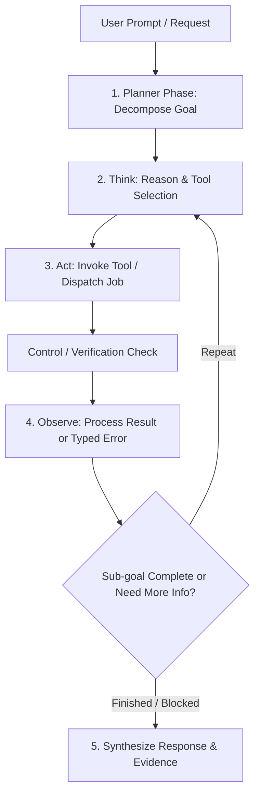

# Vectoris — AI Agent Runtime

**Status:** LOCKED (Control loop, guards, error contracts, async execution pattern)  
**Owner of:** Agent execution control loop, runtime bounds, tool error handling contracts, concurrency, and async job integration  
**Does not own:** High-level AI architecture (→ AI_SYSTEM.md), fine-tuning strategy (→ VECTORIS_BRAIN.md), tool inventory & permissions (→ TOOL_SYSTEM.md)

---

## 1. Control Loop Architecture

The Vectoris Agent runs a structured **ReAct (Reason + Act + Observe)** execution loop with a formal **Planner / Executor** decomposition for multi-step tasks.



### 1.1 Decomposition (Planner Phase)
When presented with complex, multi-step, or multi-file prompts (e.g., *"Find all power cables for the PAC units and verify takeoffs across all 12 electrical sheets"*), the Brain first outputs an explicit execution plan of sub-goals before executing tools. This separates strategic decomposition from tool-level execution.

### 1.2 Execution Cycle (ReAct)
For each sub-goal, the runtime loops through:
1. **Think:** Brain examines conversation context, memory, and prior observations to select tools.
2. **Act:** Tool Executor runs the chosen tool(s) locally, in-process, or dispatches to Celery.
3. **Verification:** Control/Verification layer intercepts the output to perform evidence, permission, and approval checks.
4. **Observe:** Verified result or structured error payload is injected into the context window for the Brain.
5. **Synthesize:** Once sub-goals are satisfied, the Brain forms a clear, evidence-linked response.

---

## 2. Runtime Bounds & Cost Guards

To prevent runaway loops, infinite retries, and unbounded compute/API expenses, every conversational turn is strictly bounded:

| Parameter | Limit | Enforcement Behavior |
|---|---|---|
| **Max Tool Calls per Turn** | `10 calls` | Halts execution; Brain yields current findings to user and requests confirmation to continue |
| **Max ReAct Iterations** | `5 cycles` | Halts loop; forces synthesis of existing progress |
| **Turn Synchronous Timeout** | `60 seconds` | Interrupts pending synchronous steps; surfaces partial results |
| **Token Budget per Turn** | `32,000 prompt tokens` | Activates context truncation / summarization filter |
| **Tool Retry Limit** | `2 retries per unique tool call` | If a tool fails twice for the same parameters, mark as unrecoverable error |

---

## 3. Typed Tool Error Handling Contract

Tool execution failures must never crash the runtime or produce silent hallucinations. Every tool returns a structured, typed response.

### 3.1 Error Payload Schema
```json
{
  "status": "error",
  "error_code": "not_found | permission_denied | timeout | validation_failed | internal_error",
  "message": "Human-readable failure description.",
  "recoverable": true,
  "details": {
    "resource_id": "optional-id",
    "required_scope": "optional-scope",
    "failed_check": "evidence | permission | approval"
  }
}
```

### 3.2 Brain Recovery Behavior by Error Code

| Error Code | Meaning | Brain Response Strategy |
|---|---|---|
| `not_found` | Target sheet, document, or entity does not exist | Check alternative sheets via `read_project_files` or prompt user for clarification |
| `permission_denied` | Requesting user lacks required role scope | Immediately halt action; explain permission constraint without retrying |
| `timeout` | Tool or local perception model exceeded duration | Retry once with lower fidelity / cloud routing, or report delay to user |
| `validation_failed` | Control/Verification evidence check failed | Discard proposed mutation; explain lack of backing source evidence to user |
| `internal_error` | Unexpected backend or parser failure | Inform user gracefully; suggest manual action or retry later |

---

## 4. Tools ↔ Celery Job Integration (Async Execution)

Tools are bifurcated into **Synchronous In-Process Tools** and **Asynchronous Long-Running Jobs**:

| Tool Type | Execution Mode | Tools | Runtime Behavior |
|---|---|---|---|
| **Lightweight / Read** | Synchronous (In-Process) | `read_project_files`, `get_project_context`, `search_project`, `create_line_item` | Blocks briefly (<500ms) and returns immediate result directly to Brain. |
| **Heavy / Pipeline** | Asynchronous (Celery Job) | `perform_takeoff`, `measure_geometry`, `export_takeoff` | Dispatches task to Redis/Celery; returns `job_id` immediately. |

### 4.1 The Stream-and-Continue Pattern
Conversational turns **never block synchronously** on multi-minute perception or takeoff jobs.

```text
User: "Run takeoff on Sheet E-104."
  ↓
Brain invokes `perform_takeoff(sheet_id="E-104")`
  ↓
Tool Executor enqueues Celery task -> Returns { status: "queued", job_id: "job-892" }
  ↓
Thinking Orb transitions to "Processing (Sheet E-104)"
  ↓
Agent yields initial response: "Started takeoff on Sheet E-104. Tracking progress..."
  ↓
[SSE Event Stream broadcasts Celery job progress (20% -> 50% -> 100%)]
  ↓
Job Completes: Proposal cards rendered on Takeoff Review & Session Canvas.
```

---

## 5. Context-Window & Multi-File Management

To handle large projects (40+ documents, 500+ sheets) without exceeding context boundaries:

1. **Hierarchical Project Index:** The base prompt only receives the lightweight project manifest and sheet directory table.
2. **On-Demand Sheet Context:** Full OCR text, vector geometry, and visual crops are loaded only when the Brain explicitly invokes `inspect_drawing` or `search_project`.
3. **Session Context Compaction:** Chat history older than 6 turns is automatically summarized into rolling session memory.
4. **Structured Evidence Referencing:** Detections are referenced by structured coordinate IDs (`sheet_id`, `x,y,w,h`) rather than embedding raw visual blobs into text contexts.

---

## 6. Concurrency Model

- **Parallel Reads:** Read-only tools (`read_project_files`, `inspect_drawing`, `search_project`) may be dispatched in parallel when the Planner identifies independent file inspections (e.g., inspecting 5 sheets simultaneously).
- **Sequential Proposals:** State-mutating tools (`create_line_item`, `update_line_item`) must execute sequentially in deterministic order to prevent race conditions in proposed changes.

---

## 7. Concrete Tool Contract Schema Standard

All Vectoris tools follow standard JSON Schema definitions for inputs and outputs:

```json
{
  "type": "function",
  "function": {
    "name": "inspect_drawing",
    "description": "Inspects a specific sheet for electrical symbols, notes, and geometry.",
    "parameters": {
      "type": "object",
      "properties": {
        "document_id": { "type": "string", "description": "UUID of the document" },
        "sheet_number": { "type": "string", "description": "Sheet identifier (e.g., E-101)" },
        "query": { "type": "string", "description": "Target inspection terms or bounding region" }
      },
      "required": ["document_id", "sheet_number"]
    }
  }
}
```

---

## 8. Cross-References

- `AI_SYSTEM.md` — Core five-layer AI architecture and trust principles
- `VECTORIS_BRAIN.md` — Fine-tuning and reasoning specialization
- `TOOL_SYSTEM.md` — Complete inventory of available tools
- `AI_MEMORY.md` — Four memory layers and persistence
- `../03_ARCHITECTURE/EVENT_SYSTEM.md` — Redis + Celery queue mechanics
