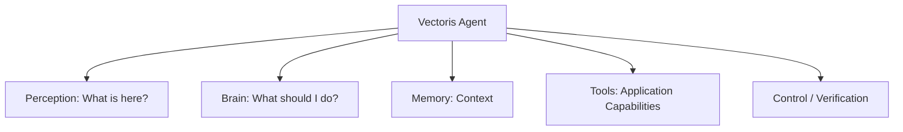
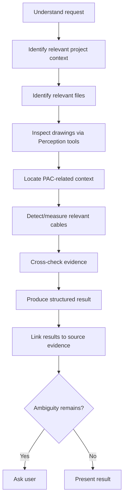

# Vectoris — AI System Architecture

**Status:** LOCKED (agentic hybrid architecture) · RECOMMENDED (specific model choices)  
**Owner of:** Overall agentic AI architecture  
**Does not own:** Brain fine-tuning specifics (→ VECTORIS_BRAIN.md), perception model specifics (→ PERCEPTION.md)

---

## 1. Core Architectural Decision

Vectoris AI is **not** one monolithic model. It is an **agentic hybrid architecture**:



| Layer | Answers | Examples |
|---|---|---|
| **Perception** | "What is here?" | Vision, OCR, geometry, extraction, classification, document understanding, symbol detection |
| **Brain** | "What should I do?" | Reasoning, planning, conversation, workflow decisions, tool selection, context handling, multi-file reasoning, clarification, policy handling |
| **Memory** | Context | Project context, company knowledge, user preferences, previous decisions, approved information |
| **Tools** | Capabilities | Read project files, inspect drawings, search project, perform takeoff, measure geometry, create/update line items, export, manipulate project state |
| **Control / Verification** | Boundaries | Validation, permissions, safety checks, evidence checks, human approval boundaries |

## 2. Agentic Behavior Requirements

The Vectoris Brain is an **agent**, not a chatbot. It must:

- Decide which tools it needs
- Decide which files to inspect
- Reason across multiple files
- Maintain project context
- Create/read/update application state through tools (never directly)
- Ask clarifying questions
- Stop when information is insufficient
- Request human approval where required
- Retry failed operations appropriately
- Validate results
- Avoid inventing capabilities it does not have
- Respect permissions and organization policy

### Example: "Find all power cables for the PAC units."



No step in this flow is a black box — every meaningful action is traceable (see `MODEL_GOVERNANCE.md`).

### Presentation Layer Flow

The AI architecture's presentation layer relies on specific UI libraries to visualize the agent's state:

```text
Vectoris Agent
      ↓
Agent Runtime
      ↓
assistant-ui
      ↓
Vectoris Chat UI
      ↓
Thinking Orb / Agent State
      ↓
Tool Results / Evidence / Actions
```

**Thinking Orb States:**
The Thinking Orb must represent *actual* agent states, not act as a permanent decoration. Valid states include:
- Processing
- Inspecting
- Searching
- Reasoning
- Waiting for approval
- Completed
- Needs clarification

## 3. Trust Principles (Binding, Not Aspirational)

1. AI suggestions are proposals; AI cannot silently overwrite approved data.
2. AI must maintain source evidence for every output.
3. AI must distinguish **known**, **inferred**, **uncertain**, and **missing** information explicitly.
4. AI must ask for clarification when necessary rather than guess.
5. AI must respect organization/user permissions.
6. AI must not claim to have performed an action it did not perform.
7. AI must not claim to have inspected a file it did not inspect.
8. AI must not fabricate product, pricing, or specification information.
9. AI must be able to stop and ask the human.

These principles are enforced structurally by the Control/Verification layer, not merely by prompting — see `TOOL_SYSTEM.md` §Verification.

## 4. Fine-Tuning vs. Retrieval — The Governing Principle

> **Fine-tuning teaches Vectoris how to behave. Memory and retrieval tell Vectoris what is true now. Tools let Vectoris interact with reality.**

This is the single most important architectural boundary in the AI system. Violating it (e.g., baking current pricing or a specific customer's catalog into model weights) is an architectural error, not a style choice — consistent with the legacy README's "Four Memory Layers" hard rule.

## 5. Hybrid + Local-first Execution Router (Locked)

Vectoris employs a strict **Hybrid + Local-first** AI execution model, governed by an Execution Router.

```text
                 Vectoris Agent
                       │
                Execution Router
                 /            \
                ↓              ↓
           LOCAL              CLOUD
              │                  │
       File processing      Approved API
       Local models         Heavy processing
       OCR / vision         Cloud inference
       Local tools          Other services
```

### The Router Policy
The router dynamically determines execution location by considering:
1. Privacy policy (is cloud permitted for this org/project?)
2. User/org permissions
3. Model availability
4. Local hardware capability
5. Task requirements
6. Network availability

### Governing Philosophy
- **Default:** Local whenever practical.
- **Cloud:** Only when permitted and explicitly governed by the applicable policy.

This ensures Vectoris maintains a genuinely local-first architecture, rather than simply claiming to "support local AI."

## 6. Model Choices — Status Summary

| Component | Direction | Status |
|---|---|---|
| Brain | Fine-tuned open-source foundation model | RECOMMENDED — see `VECTORIS_BRAIN.md` |
| Perception | Architecture supports local + cloud + routing via Execution Router | **LOCKED** (architecture) — see `PERCEPTION.md` |
| Training from scratch | Not planned unless future evidence strongly justifies it | REJECTED (for now) |

## 6. Cross-References

- `VECTORIS_BRAIN.md`, `PERCEPTION.md`, `AI_MEMORY.md`, `TOOL_SYSTEM.md`, `TRAINING.md`, `EVALUATION.md`, `MODEL_GOVERNANCE.md`
- `../02_DESIGN/UX_PRINCIPLES.md` for how these principles surface in UI
