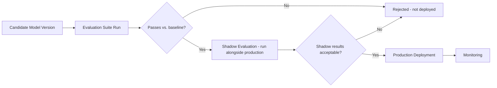

# Vectoris — Model Governance

**Status:** RECOMMENDED  
**Owner of:** Versioning, consent, deployment gating  
**Does not own:** Evaluation metrics themselves (→ EVALUATION.md)

---

## 1. Versioning

Every model in production (Brain, each Perception model) has an explicit version identifier. Every AI-derived artifact (detection, correction proposal, agent response) records the model version(s) that produced it — this is non-negotiable, mirroring the legacy README's MVP Data Model (`model_version` field).

## 2. Deployment Gating



A new model version must pass the Evaluation Suite (`EVALUATION.md`) and a shadow-evaluation period (running alongside the current production model, comparing outputs) before replacing the production version — preserved from the legacy README's learning-pipeline caution against direct correction-to-retraining shortcuts.

## 3. Full Auditability Chain

For every meaningful AI action, it must be possible to reconstruct:

- What did Vectoris believe? (the AI output)
- What evidence did it use? (source document/coordinates, or prior decisions)
- Which model/version produced it?
- What did the human change?
- What became the final, approved truth?

```text
Detection -> AI model -> model_version -> source_document -> source_coordinates
   -> AI_output -> human_correction -> user -> timestamp -> final_approved_result
```

This is the same chain described in the legacy README's Auditability section, preserved as a binding architectural requirement.

## 4. Consent Governance

Model training consent (customer opt-in for data-improvement use) and cloud-processing consent (per `../03_ARCHITECTURE/SECURITY.md`) are tracked per-organization and must be checked before any data flows into a training-eligible pipeline or a cloud perception call. Exact consent data model: **TBD**.

## 5. Rollback

If a deployed model version is found to regress quality (via monitoring or user reports), governance must support rolling back to the prior production version without data loss — mechanics TBD, implementation-phase detail.

## 6. Cross-References

- `TRAINING.md`, `EVALUATION.md`
- `../03_ARCHITECTURE/SECURITY.md` §Model Training Consent
- `../07_OPERATIONS/OBSERVABILITY.md`
