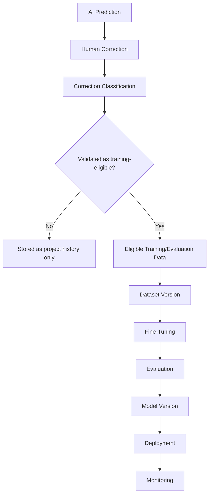

# Vectoris — Training & Feedback System

**Status:** RECOMMENDED (pipeline shape) · TBD (legal/privacy specifics)  
**Owner of:** Correction → dataset → fine-tune pipeline  
**Does not own:** Evaluation metrics (→ EVALUATION.md), model deployment gating (→ MODEL_GOVERNANCE.md)

---

## 1. Core Principle

Human corrections are valuable signal, but **a correction is not automatically a model error.** It may represent a model error, hidden project knowledge, a scope decision, a business rule, a user preference, or an inconsistency between sheets. Every correction must be **classified** before it can become training data — preserved unchanged from the legacy README's Correction Taxonomy principle.

## 2. Correction Classification Categories

- Model error
- User/business preference
- Project-specific rule
- Incorrect user correction (the human's edit was itself wrong)
- Ambiguous case
- Data issue
- Other

This extends the legacy taxonomy (`missed`, `false_positive`, `wrong_symbol`, `wrong_classification`, `duplicate`, `scope_excluded`, `sheet_conflict`, `manual_override`, `other` — see `../03_ARCHITECTURE/DATA_MODEL.md`) with a training-eligibility lens.

## 3. Pipeline

**Do not let "human correction → automatic retraining" become the architecture.** This is a hard rule carried forward unchanged from the legacy README — it prevents model drift and unvalidated data from silently entering training.

## 4. Data Privacy Default

Customer/project data does **not** automatically enter global training. Default: customer/project data remains private to that customer. If a customer accepts a data-improvement policy, eligible/anonymized/appropriate data **may** contribute to model improvement — the exact legal/privacy mechanics of consent, anonymization, and retention are **TBD** and require legal counsel before any production data collection. This is an open decision item, not resolved by this document — see `../OPEN_DECISIONS.md`.

## 5. What This Pipeline Feeds

- Fine-tuning updates to the Vectoris Brain (behavior) — see `VECTORIS_BRAIN.md`
- Fine-tuning/calibration updates to Perception models — see `PERCEPTION.md`
- The Vectoris Evaluation Suite and Benchmark — see `EVALUATION.md`

## 6. Cross-References

- `../03_ARCHITECTURE/DATA_MODEL.md` (Correction Event entity)
- `EVALUATION.md`, `MODEL_GOVERNANCE.md`
- `../03_ARCHITECTURE/SECURITY.md` §Model Training Consent
