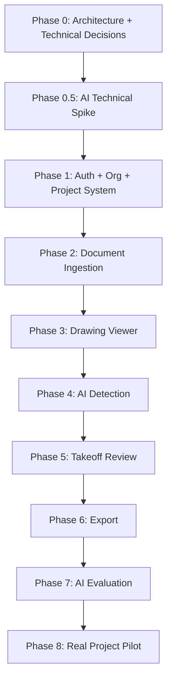

# Vectoris — Implementation Flow

**Status:** RECOMMENDED  
**Owner of:** Build sequence across all layers  
**Does not own:** Phase-internal task breakdown (→ DEVELOPMENT_PHASES.md), design content

---

## 1. Sequence Overview

## 2. Governing Rule

**The AI technical spike (Phase 0.5) must happen before excessive UI polish.** The core open question the spike must answer: *"Can Vectoris understand messy real electrical drawings well enough to produce a useful takeoff?"* — tested against real drawing packages, not only clean demo files, per legacy `THESIS.md` Risk 1.

## 3. Why This Order

- Architecture and the technical spike come first because they de-risk the hardest unknown (detection quality on messy real drawings) before any UI investment.
- Auth/org/project system precedes ingestion because every downstream entity (documents, takeoff runs) is scoped to an org/project.
- The drawing viewer precedes AI detection in the build sequence but is validated together with it — a viewer with nothing to show is not independently useful, but building detection without a place to review it is equally incomplete; Phases 3–4 should be treated as tightly coupled in scheduling even though listed sequentially.
- Export comes after Takeoff Review because export transforms *approved* structured data, which does not exist until review/approval exists.
- AI Evaluation (Phase 7) is listed after core functionality but the Evaluation Suite skeleton (`../04_AI/EVALUATION.md`) should exist from Phase 0.5 onward — Phase 7 is when it becomes comprehensive and gates further model changes, not when it's first created.

## 4. UI Library Selection & Adaptation Rules

When moving from Phase 0 to Phase 1 and beyond, third-party UI libraries (ReactBits, Bklit UI, assistant-ui, Skiper UI) will be introduced.

**The Golden Rule of UI Implementation:**
Third-party libraries implement the product; they do not change what Vectoris is or what it looks like.
1. Every third-party component must be structurally stripped and rebuilt to match the Vectoris Design System tokens (`../02_DESIGN/DESIGN_SYSTEM.md`).
2. No library may introduce its own color palette, shadow system, or spacing rhythm.
3. Components are selected for their functional/structural capability (e.g., a data table from Bklit UI, a chat framework from assistant-ui), not their default aesthetics.

See `DEPENDENCIES.md` for the locked library list and `../02_DESIGN/COMPONENTS.md` for component mapping.

## 4. Cross-References

- `DEVELOPMENT_PHASES.md` for exit criteria per phase
- `../00_PROJECT/PRODUCT_SCOPE.md` for what each phase is and isn't allowed to include
