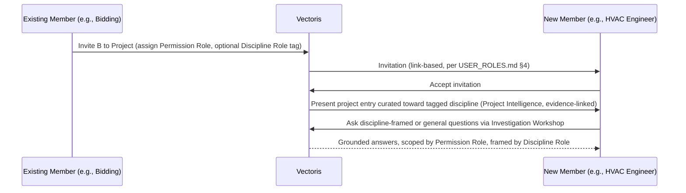

# Vectoris — Collaboration (Domain Specification)

**Status:** PROPOSED (discipline-role layer) · LOCKED (org/permission layer — unchanged, see `../01_PRODUCT/USER_ROLES.md`)
**Owner of:** How a Project becomes useful to a person who did not upload its documents; the conceptual distinction between *permission* (what you're allowed to do) and *discipline context* (what you came here to understand)
**Does not own:** Permission matrix mechanics (→ `../01_PRODUCT/USER_ROLES.md`, unchanged), backend implementation of membership/invites (→ future `../03_ARCHITECTURE/DATA_MODEL.md` extension), evidence-grounding rules (→ `PROJECT_INTELLIGENCE.md`)

---

## 1. The Product Question This Answers

> A bidding employee brings an HVAC engineer into a project. The HVAC engineer should not need to manually receive dozens of PDFs. How do they get to a useful understanding of the project fast?

`USER_ROLES.md` already defines **who can do what** (Owner/Admin/Manager/Editor/Viewer, at Organization/Project/Session scope). It does not define **what a given person needs to see first**, or **why**. This document adds that second layer. It does not change the permission matrix in `USER_ROLES.md` — it sits alongside it.

## 2. Two Independent Layers

```text
Permission Role (LOCKED, USER_ROLES.md)
    Owner / Admin / Manager / Editor / Viewer
    → governs WHAT a person may do (upload, correct, approve, export, delete)

Discipline Role (PROPOSED, this document)
    Estimator / Electrical Engineer / HVAC Engineer / Project Manager /
    Procurement / Site Engineer / Sales-BD / Management
    → governs WHAT CONTEXT a person is oriented toward by default
```

A person has exactly one Permission Role per project (per `USER_ROLES.md`) and **may have zero, one, or more** Discipline Role tags. Discipline Role is metadata for context curation and AI-Session framing — it never grants or restricts a data-mutation permission. An Editor tagged "HVAC Engineer" can still edit anything an Editor can edit; the tag only changes what Vectoris surfaces first and how the Agent frames answers (see `PROJECT_INTELLIGENCE.md` §5).

This separation is deliberate: conflating "what discipline are you" with "what can you do" would make the permission model brittle every time a new discipline is added. Discipline Role is intentionally cheap to extend; Permission Role is intentionally not.

## 3. Discipline Roles (Candidate List — PROPOSED, Not Locked)

| Discipline Role | Typical Questions (see also `../06_PAGES/AI_SESSION.md`) |
|---|---|
| Estimator / Bidding | "What quantities are driving the estimate?" |
| Electrical Engineer | "Where does the cable tray routing change?" |
| HVAC Engineer | "Explain the cooling scope and relevant drawings." |
| Project Manager | "What are the unresolved project issues?" |
| Procurement | "What equipment and materials are required?" |
| Site Engineer | "Where is this equipment installed?" |
| Sales / Business Development | Deal-level qualification questions — see `ESTIMATION_BIDDING_DOMAIN.md` §4.2 `DealContext` |
| Management | "What is the current project and commercial position?" |

This list is a **starting set surfaced by the founder brief**, not a final taxonomy. Organizations may need custom discipline tags (TO VALIDATE). Do not hard-code this list as exhaustive in any implementation without an explicit decision — see `../OPEN_DECISIONS.md` OD-25.

## 4. How Discipline Role Informs Context (Without Restricting Access)

A Discipline Role changes **defaults and framing**, never **access boundaries**:

- **Project Overview default view:** may surface the subset of documents/drawings/takeoff most relevant to the tagged discipline first, with a clear, one-click path to the full project (never a hidden or hard-walled subset).
- **Investigation Workshop framing:** when an investigation is opened by a user with a Discipline Role, the Agent's first-turn context and clarifying-question style lean toward that discipline's typical vocabulary and concerns (per the question patterns in §3) — but the Agent still answers questions outside that discipline if asked; it does not refuse or redirect.
- **Referral flow (§5):** when inviting someone to a project, the inviter may tag the invitee's discipline, which seeds their first-visit context curation. The invitee can change or add discipline tags for themselves at any time.

**Hard boundary:** Discipline Role must never be implemented as a data-access filter that hides project content a person's Permission Role would otherwise allow them to see. That would silently create a two-tier access system through the back door of a UX convenience feature. If a project genuinely needs to restrict what a Viewer/Editor can see (not just what's shown first), that is a Permission Role / project-scoping decision, not a Discipline Role decision — flag it in `USER_ROLES.md`, not here.

## 5. Referral / Invite Flow (Conceptual)



This reuses the existing link-based invitation mechanism (`USER_ROLES.md` §4) — it adds an optional Discipline Role field to the invite payload, and adds a Project Intelligence-driven entry experience (`PROJECT_INTELLIGENCE.md`) instead of dropping the new member on an empty or generic document list.

## 6. Shared Sessions vs. Shared Project Context

`USER_ROLES.md` §5 and `AI_SESSION.md` already distinguish project-level access from session-level sharing (a session Viewer does not automatically gain project Viewer rights). This document does not change that isolation boundary. It only adds: when a new project member arrives via referral, their *first* experience should be Project Intelligence-driven (project-scoped, not a specific prior session), unless the inviter explicitly shares a specific session with them.

## 7. Open Questions This Document Surfaces

These are **new** open decisions, not yet in `../OPEN_DECISIONS.md` before this document:

- Whether Discipline Role is single- or multi-select per user, and whether it is per-project or per-organization-default
- Whether an organization can define custom Discipline Role tags or the list is fixed
- Exact UI for "curated first view" — a filtered Overview, a guided walkthrough, or an AI-Session-first entry
- Whether Discipline Role should ever influence *default* Permission Role suggestions at invite time (e.g., defaulting Procurement to Viewer) — this must remain a suggestion a human confirms, never an automatic grant, per the same human-authority principle as `VISION.md` §2

See `../OPEN_DECISIONS.md` OD-25.

## 8. MVP vs. Near-Term vs. Future

| Capability | Horizon |
|---|---|
| Org/Project/Session Permission Roles, link-based invites | **MVP (already scoped, unchanged)** |
| Discipline Role tagging on invite and profile | **NEAR-TERM — OPEN DECISION (OD-25)** |
| Curated first-view by discipline | **NEAR-TERM/FUTURE**, depends on `PROJECT_INTELLIGENCE.md` synthesis capability landing |
| Custom org-defined discipline taxonomies | **FUTURE — not yet evidenced** |

## 9. Cross-References

- `../01_PRODUCT/USER_ROLES.md` — Permission Role model this document extends, not replaces
- `PROJECT_INTELLIGENCE.md` — the synthesis capability that makes a curated first-view possible
- `../06_PAGES/AI_SESSION.md` — where discipline framing surfaces conversationally
- `../03_ARCHITECTURE/STORAGE.md` §5, `../OPEN_DECISIONS.md` OD-05 — the still-unresolved question of how a second user sees a project whose raw files live on the first user's device; Discipline Role does not resolve this, it's an orthogonal concern
